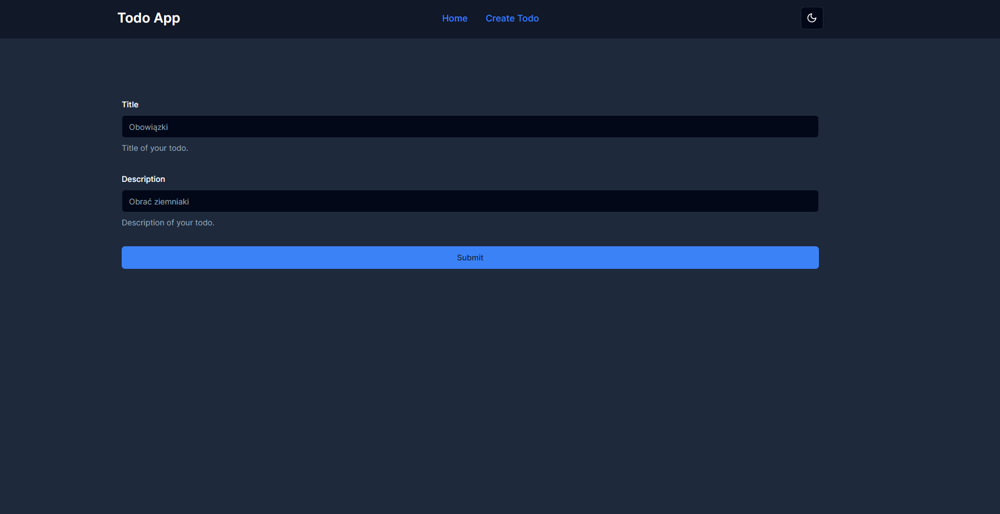
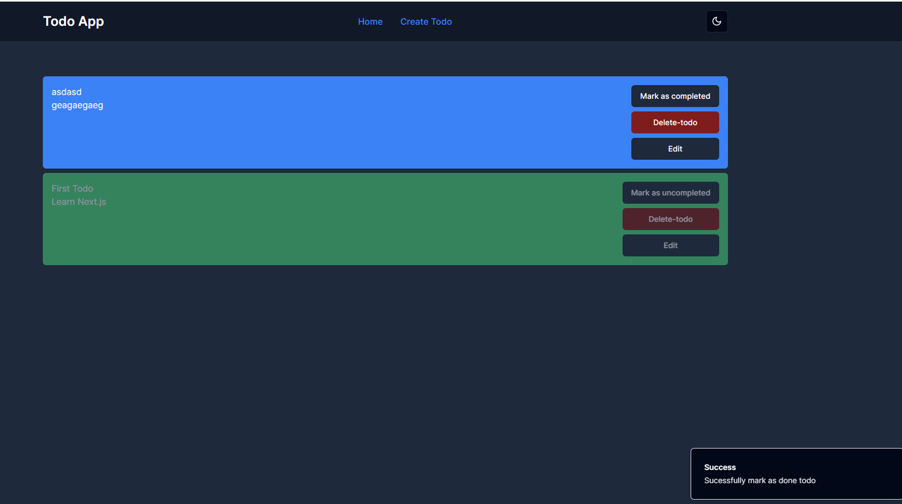
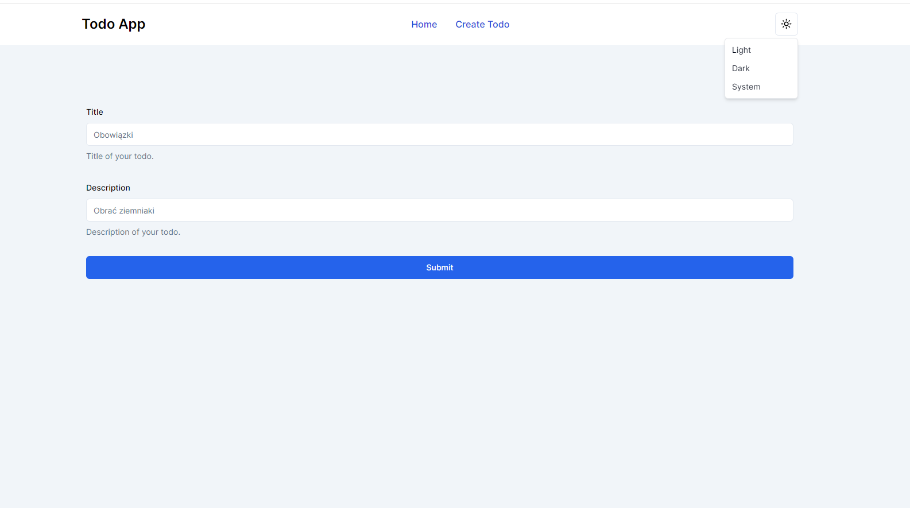
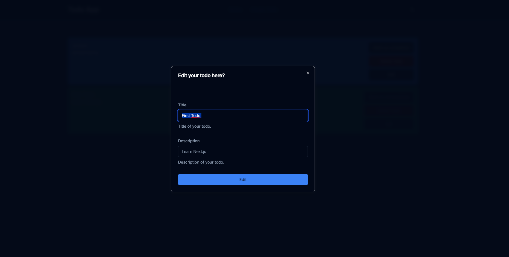

## This is a basic TodoApp in mongoDB + NextJS stack








## Getting Started
First: Download Project.
Second: Install dependencies:
```bash
npm install
```
Third: run the development server:
```bash
npm run dev
# or
yarn dev
# or
pnpm dev
# or
bun dev
```
Rename ".env.example" file to ".env" and replace content with your mongoURI


Open [http://localhost:3000](http://localhost:3000) with your browser to see the result.

